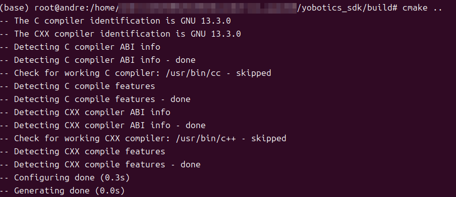
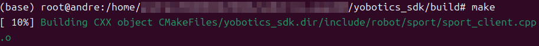

# 4.2 Build the SDK

## Dependencies

```bash
sudo apt-get install -y build-essential cmake liblcm-dev libeigen3-dev
```

## Build

```bash
cmake -S yobotics_sdk -B yobotics_sdk/build
cmake --build yobotics_sdk/build -j4
```





A successful build contains:

```text
yobotics_sdk/build/yobot_sport_client
yobotics_sdk/build/yobot_robot_state_client
yobotics_sdk/build/yobot_http_server
yobotics_sdk/lib/libyobotics_sdk.a
```


## LCM URL

The SDK uses `udpm://239.255.76.67:7667?ttl=255` by default. For cross-machine use or another multicast address:

```bash
export YOBOTICS_LCM_URL='udpm://239.255.76.67:7667?ttl=255'
```


When linking the static library from a business program, you need at least the SDK include directory, `libyobotics_sdk.a`, LCM, and pthread.

## Build Acceptance

```bash
test -x yobotics_sdk/build/yobot_sport_client
test -x yobotics_sdk/build/yobot_robot_state_client
test -x yobotics_sdk/build/yobot_http_server
test -f yobotics_sdk/lib/libyobotics_sdk.a
```

| Failure | Check |
| --- | --- |
| LCM not found | `liblcm-dev`, `find_library` search directories, and architecture |
| Header not found | Whether CMake uses `yobotics_sdk` as the source directory |
| pthread link failure | Whether the system build toolchain is complete |
| Program starts but has no state | Whether `YOBOTICS_LCM_URL` matches the controller |

This CMake project only builds the SDK static library and three existing examples. It does not build the controller or provide RK3588 packaging/deployment flow.
