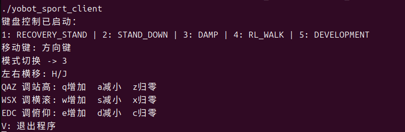

# 4.3 Motion Control

`SportClient` keeps the following public methods:

```cpp
SportClient client;
client.EnableLCMControl();
client.RecoveryStand();
client.RLWalk();
client.Move(0.2f, 0.0f, 0.0f);
client.BodyHeight(0.0f);
client.Euler(0.0f, 0.0f);
```

## API Numbers

| Method/mode | API |
| --- | --- |
| `Passive()` | 1000 |
| `Damp()` | 1001 |
| `RLWalk()` | 1002 |
| `Development()` | 1005 |
| `RecoveryStand()` | 1006 |
| `StandDown()` | 1007 |

## Method Semantics

| Method | Behavior |
| --- | --- |
| `EnableLCMControl()` | Sets `rc_enable=1` and publishes, allowing the controller to accept LCM high-level input |
| `DisableLCMControl()` | Sets `rc_enable=0` and publishes |
| `Passive()` / `Damp()` | Switches mode and clears velocity, height, and posture fields |
| `RecoveryStand()` / `StandDown()` | Switches mode and clears motion fields |
| `RLWalk()` | Sets the RL walking API and preserves current motion fields |
| `Development()` | Sets the DEVELOPMENT API and preserves current motion fields |
| `Move(vx, vy, vyaw)` | Updates three velocity components and publishes immediately |
| `BodyHeight(h)` | Clamps height to `[-1.0, 0.2]` and publishes |
| `Euler(roll, pitch)` | Clamps each value to `[-0.5, 0.5]` and publishes |

All public methods currently return `0`, meaning the command was submitted to the SDK publish path. It does not mean the controller has switched successfully. Applications should confirm through the state channel.

Motion programs should periodically send `EnableLCMControl()`, the current mode, and motion commands. A command sent only once may be overwritten by gamepad input or timeout logic.

```cpp
#include <chrono>
#include <thread>
#include "robot/sport/sport_client.hpp"

using yobotics::robot::SportClient;

SportClient client;
client.EnableLCMControl();
client.RecoveryStand();
std::this_thread::sleep_for(std::chrono::seconds(2));

for (int i = 0; i < 100; ++i) {
  client.EnableLCMControl();
  client.RLWalk();
  client.Move(0.1f, 0.0f, 0.0f);
  std::this_thread::sleep_for(std::chrono::milliseconds(40));
}

client.Move(0.0f, 0.0f, 0.0f);
client.Damp();
client.DisableLCMControl();
```

The example period is about 25 Hz and only demonstrates continuous sending. Validate the business frequency according to the controller, network, and application requirements.

## Keyboard Example

```bash
yobotics_sdk/build/yobot_sport_client
```



Arrow keys control forward/backward motion and turning. `H/J` strafe, `Q/A/Z` adjust or reset height, `W/S/X` adjust or reset roll, `E/D/C` adjust or reset pitch, and `V` exits.

!!! danger
    The SDK publishes motion commands to the real controller. Before connecting to hardware, run the same example in simulation and keep velocity commands conservative.

## Acceptance and Stop

- Run the state client before the motion client.
- Confirm through state after every mode call instead of relying only on return values.
- Actively send zero velocity when keys are released or the business loop ends.
- Switch back to `DAMP` before exiting, then disable LCM control.
- Do not let multiple SDK clients publish to the same control channel at the same time.
