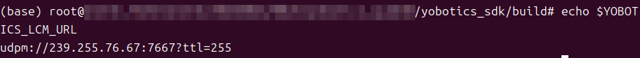

# 4.2 编译 SDK

## 依赖

```bash
sudo apt-get install -y build-essential cmake liblcm-dev libeigen3-dev
```

## 编译

```bash
cmake -S yobotics_sdk -B yobotics_sdk/build
cmake --build yobotics_sdk/build -j4
```


成功后包含：

```text
yobotics_sdk/build/yobot_sport_client
yobotics_sdk/build/yobot_robot_state_client
yobotics_sdk/build/yobot_http_server
yobotics_sdk/lib/libyobotics_sdk.a
```


## LCM URL

SDK 默认使用 `udpm://239.255.76.67:7667?ttl=255`。跨机器或指定其他多播地址时：

```bash
export YOBOTICS_LCM_URL='udpm://239.255.76.67:7667?ttl=255'
```



业务程序链接静态库时至少需要 SDK include、`libyobotics_sdk.a`、LCM 和 pthread。

## 编译验收

```bash
test -x yobotics_sdk/build/yobot_sport_client
test -x yobotics_sdk/build/yobot_robot_state_client
test -x yobotics_sdk/build/yobot_http_server
test -f yobotics_sdk/lib/libyobotics_sdk.a
```

| 失败现象 | 检查 |
| --- | --- |
| 找不到 LCM | `liblcm-dev`、`find_library` 搜索目录和架构 |
| 找不到头文件 | CMake 是否以 `yobotics_sdk` 为源码目录 |
| 链接 pthread 失败 | 系统构建工具链是否完整 |
| 程序启动后没有状态 | `YOBOTICS_LCM_URL` 与控制器是否一致 |

该 CMake 工程只构建 SDK 静态库和三个现有示例，不构建控制器，也不提供 RK3588 打包或部署流程。
